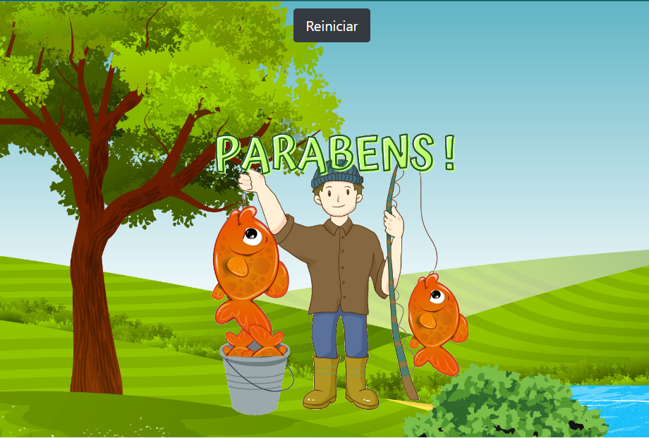
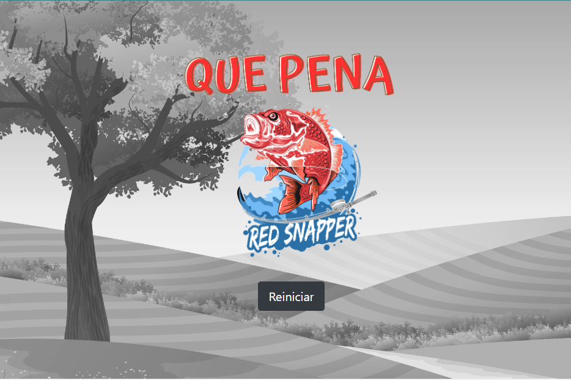

# App-em-Javascript
## Game pescaria 
### O jogo Pescaria foi criado em JavaScript.
### Funciona assim, você escolhe o nível de velocidade que iram aparecer os Peixes RÂNDOMICAMENTE com um tempo e limite de peixes não capturados

---------------------------------------------------------
## TECNOLOGIAS UTILIZADAS

### HTML5
### CSS3
### BOOTSTRAP
### JAVASCRIPT
--------------------------------------------------------
## Tela de inicio

--------------------------------------------------------
## Tela do Game

-------------------------------------------------------
## Tela de Vitória

------------------------------------------------------
## Tela de Game-Over

